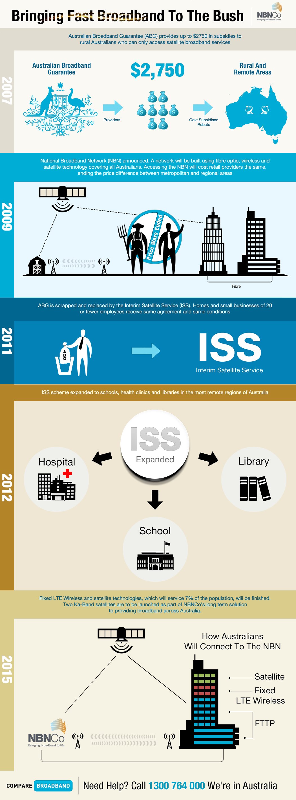

# ABG

* `ABG`
  * =`Australian Broadband Guarantee`
    * =`IPSTAR Broadband`=`IPSTAR Satellite Service`
  * 适用范围：只用于澳大利亚（的农村乡下偏远地方）
  * 现状：2011年6月30日其已停止服务
    * 被`NGN`（的`ISS`）取代
* `NBN`
  * =`National Broadband Network`
    * =`NBN Sky Muster Satellite service`
* `ISS`
  * =`Intersim Satellite Service`
* 总结
  * 
