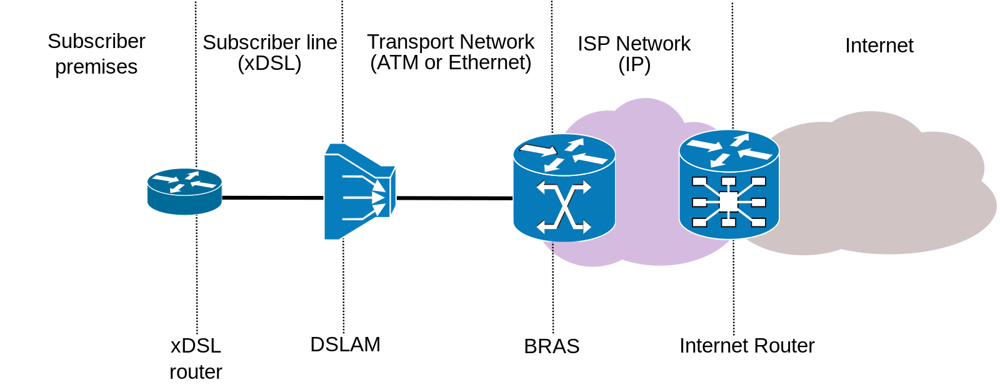

# DSLAM

* 背景
  * `xDSL`
    * `DSL`
      * =`Digital Subscriber Line`=`数字用户线路`
    * 包含
      * `HDSL`
      * `SDSL`
      * `VDSL`
      * `ADSL`=`Asymmetric Digital Subscriber Line`=`非对称数字用户线路`
* `DSLAM`
  * =`Digital Subscriber Line Access Multiplexer`=`数字用户线接入复用器`
  * 一句话描述：透过电话线提供高速互联网接入服务
  * 详解
    * `DSLAM`是一种安装在近客户端的网络设备
      * 利用多任务技术将大量用户的`DSL`线路连接至高速骨干网络
  * `DSLAM`的聚合`DSL` 线路方式=接入方式
    * `ATM`=`Asynchronous Transfer Mode`=`非对称传输模式`
    * `FR`=`Frame Relay`=`帧中继`
    * `Internet Protocol Network`=`IP网络`
  * xDSL连接图
    * 
