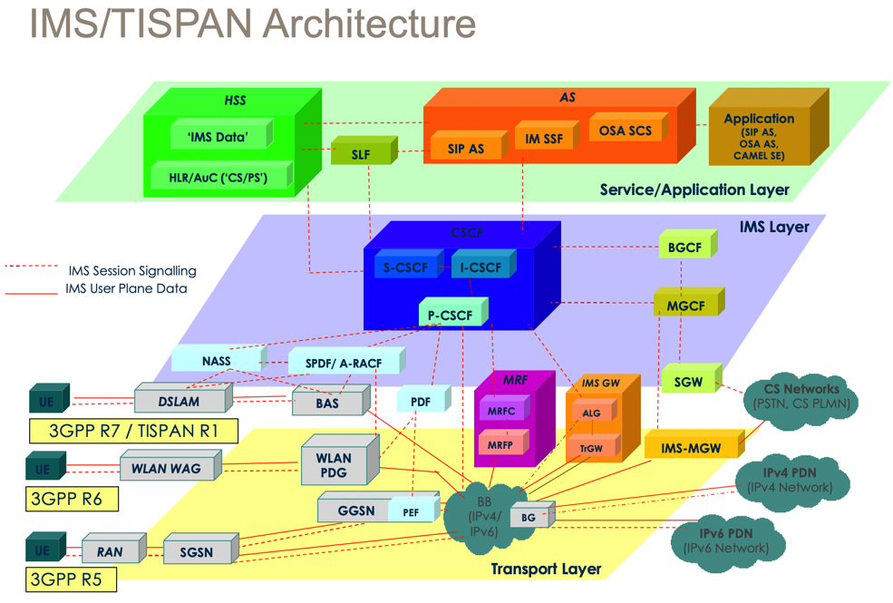
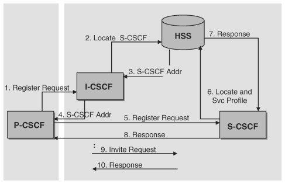
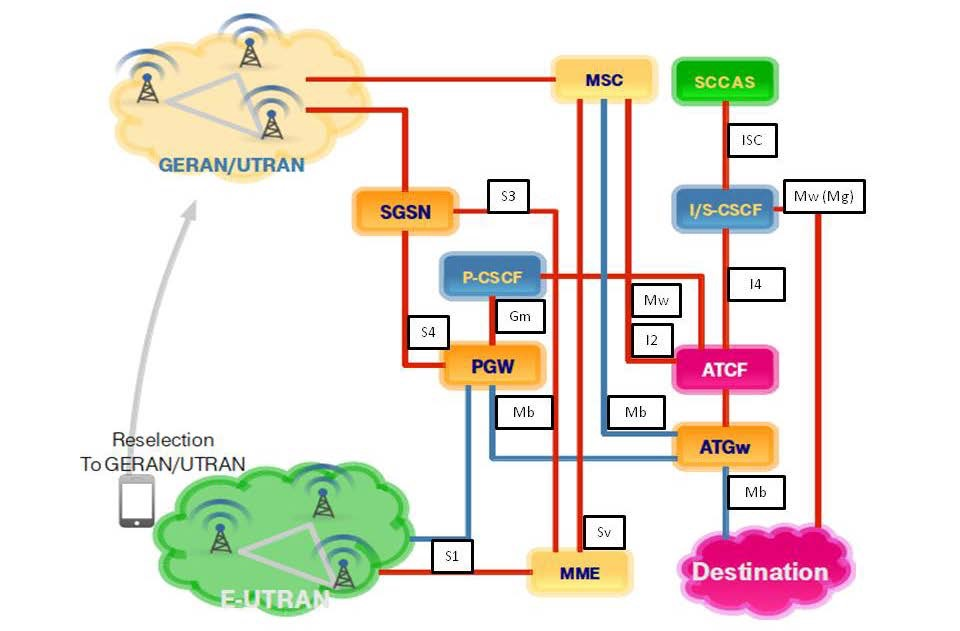
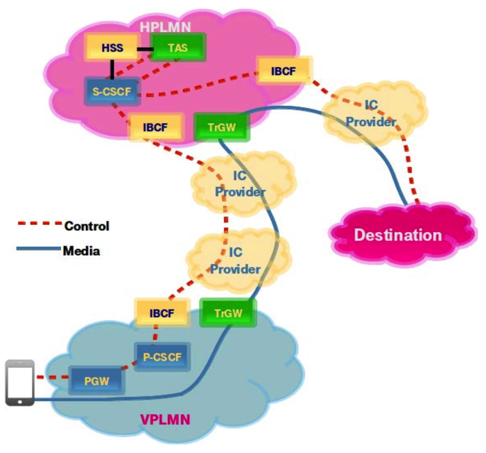
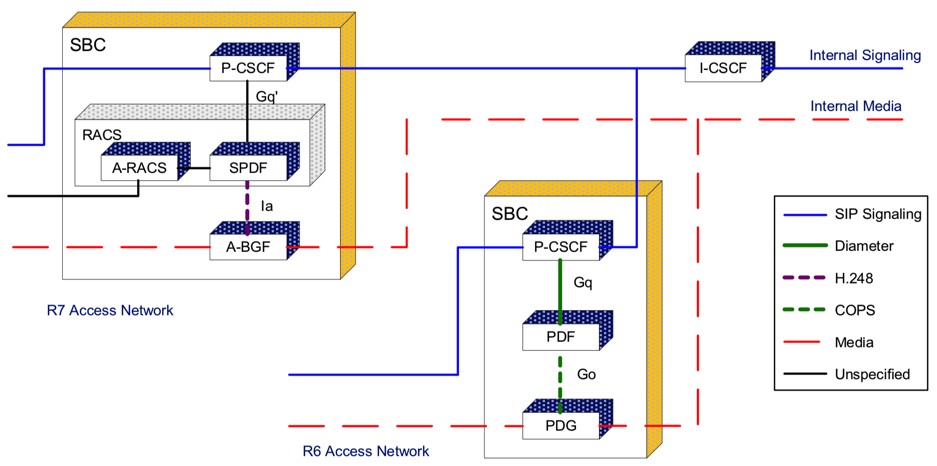
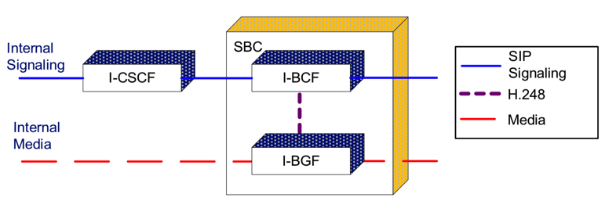
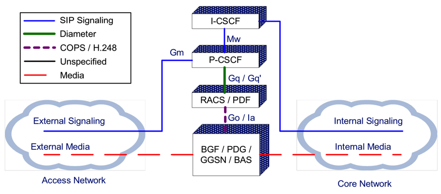
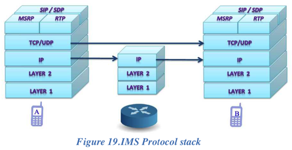
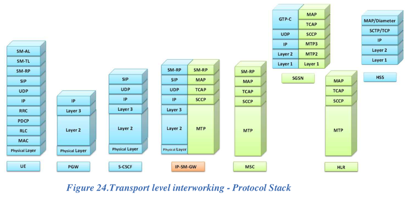
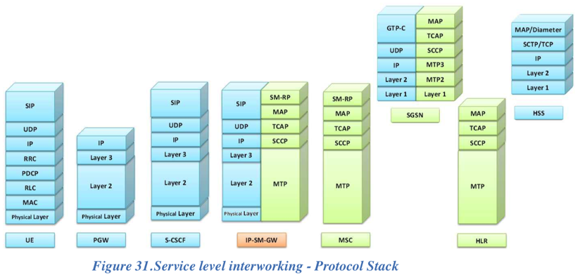

# IMS元素

对于IMS架构

其中的：

* 核心元素和简介
  * `AS`=`Application Server`=`应用服务器`
    * Executes service logic associated with value-added services
    * Provides enhanced and intelligent services to subscribers
  * `CSCF`=`Call Session Control Function`=`调用会话控制功能`
      * `P-CSCF`=`Proxy CSCF`
        * is the first point of contact and the control point for the User Equipment (UE) within the Service Provider network. It forwards session requests from the UE to the S-CSCF
      * `S-CSCF`=`Serving CSCF`
        * has access to the user subscription data and actually handles the session request
      * `I-CSCF`=`Interrogating CSCF`
        * is the first contact point within a Service Provider network for all incoming session requests from another Service Provider
  * `BGCF`=`Breakout Gateway Control Function`
    * Identifies the network that will be used for connecting IP sessions to the PSTN
  * `HSS`=`Home Subscriber Server`=`归属用户服务器`=`HSS用户数据库`
    * Stores all the static and dynamic information for a subscriber
    * Maintains a list of features and services associated with a user, and also the location and means of access to the user
    * Provides user profile information
  * `SLF`=`Subscription Locator Function`
    * Queried during Registration and Session Setup to get the name of the HSS containing the required subscriber specific data
  * `MGCF`=`Media Gateway Control Function`
    * Controls the parts of the call state that pertain to connection control for media channels in a T-MGF MGW
    * Selects the CSCF depending on the routing number for incoming calls from legacy networks
    * Performs protocol conversion between ISUP and call control protocols (e.g., SIP) and maintains call states
  * `MRF`
    * `MRFC`=`Multimedia Resource Function Controller`
      * Controls the media stream resources in the MRFP under direction from an S-CSCF or Application Server
      * Interprets information coming from an AS or S-CSCF (e.g., session identifier) and controls MRFP accordingly
    * `MRFP`=`Multimedia Resource Function Processor`
      * Provides media resources under the direction of MRFC
      * May generate media streams (e.g., multimedia announcements), mix incoming media streams for multiple parties, or process media streams (e.g., audio trans-coding, media analysis)
  * `PDF`=`Policy Decision Function`
    * Provides management of network QoS resources, authorization of resource allocations, and makes policy decisions with regard to use of network QoS resources
    * `SPDF`=`Service Policy Decision Function`
  * `T-MGF`=`Trunk Media Gateway Function`
    * Terminates bearer channels from a switched circuit network and media streams from a packet network (e.g., RTP streams in an IP network)
    * Establishes and releases connections between these channels under control of the MGCF in support of calls between PSTN and IP network
  * `SGF`=`Signaling Gateway Function`
    * Acts as a gateway between the IP call/session control signaling and the SS7-based PSTN signaling
    * May provide signaling translation, for example between SIP and SS7 or simply signaling transport conversion e.g., SS7 over IP to SS7 over TDM
  * `A-BGF`=`Access Border Gateway Function`
    * Packet gateway between an access network and a core network used to mask a service provider’s network from access networks, through which UE accessing packet-based services (e.g., IMS, Internet)
    * Functions may include Opening and closing gate, Traffic classification and marking, Traffic policing and shaping, Network address and port translation, and Usage information
    * Under control of the PDF
  * `I-BGF`=`Interconnection Border Gateway Function`
    * Packet gateway used to interconnect a service provider’s core network with another service provider’s core network supporting the packet-based services
    * Functions may be the same as that of the A-BGF
  * `I-BCF`=`Interconnection Border Control Function`
    * Controls I-BGF to interwork with other packet-based networks
    * May support the following functions (not limited to)
      * Inter-domain protocol normalization and/or repair
      * Inter-domain protocol interworking
      * Interaction with PDF for resource reservation, resource allocation, and/or other resource related information
  * `MRB`=`Media Resource Broker`
    * Assigns specific media server resources to incoming calls at the request of service applications (i.e., an AS)
    * Acquires knowledge of media server resources utilization and reservation requests that it can use to help decide which media server resources to assign to resource requests from applications
    * Employs methods/algorithms to determine media server resource assignment

## 子元素详解

### AS

* `AS`=`Application Server`=`应用服务器`
    * 作用：SIP应用服务器负责和提供服务
    * 其他说明
      * 它与S-CSCF之间使用SIP
    * 模式
      * 基于具体的服务不同，AS可以选择不同的SIP模式
        * SIP代理模式
        * SIP用户代理（UA - User agent）模式
        * SIP B2BUA模式
    * 部署位置
      * 可以设置在：IMS本网内
        * 如果位于本网，它还可以使用Sh或Si接口查询HSS。
      * 也可以设置在：外部的第三方网络
    * 典型案例
      * VCC Server
        * 由3GPP开发的语音持续调用功能
      * SIP AS
        * 负责和提供IMS具体服务
      * IM-SSF
        * =IP Multimedia Service Switching Function=IP多媒体切换功能
        * SIP和CAP之间的接口，用于与CAMEL应用服务器通信
      * OSA SCS
        * =OSA Service Capability Server=OSA服务性能服务器
          * OSA=Open Service Architecture=开放服务架构
        * SIP和OSA框架之间的接口
        * 多个OSA服务之间的交互
    * 功能模型
      * AD-ILCM和AS-OLCM用来保存事务状态并且可以根据特定服务的需要保存会话状态
      * 对于S-CSCF来说
        * AS-ILCM接口是输入端
        * AS-OLCM接口是输出端
      * 应用逻辑提供服务和AS-ILCM、AS-OLCM之间的交互
    * PSI
      * =Public Service Identity=公共服务标识
      * 用来标识应用服务提供的服务
      * PSI可以提供两种标识格式
        * SIP URI
        * Tel URI
      * 通常被HSS以完整PSI或通配PSI保存
      * 说明
        * 完整PSI包含完整的PSI标识，可以直接用来路游
        * 通配PSI表达一组PSI标识

### CSCF

* `CSCF`=`Call Session Control Function`=`调用会话控制功能`
  * 是什么
    * SIP服务器和代理共同实现通话控制功能，统称为：`CSCF`
  * 会话控制流程
    * 
  * 功能：它们在IMS系统中处理SIP信号数据包
  * 包含
    * `P-CSCF`=`Proxy CSCF`
      * 概述
        * is the first point of contact and the control point for the User Equipment (UE) within the Service Provider network. It forwards session requests from the UE to the S-CSCF
        * 是一个SIP代理，作为与IMS终端直联通信点
        * 它可以设置在公网中也可以设置在IMS本网中
        * 某些网络在这个功能组中可能使用了SBC
          * SBC= Session Border Controller=会谈边界控制器
        * P-CSCF其核心是一个特殊的SBC
          * 该SBC使用的用户网络接口不仅保护网络，也保护了IMS终端
          * 在IMS终端和P-CSCF之间传递加密信号时，使用附加的SBC是毫无意义同时也是不可用的。
        * 终端可以使用DHCP协议来找到它的P-CSCF，也可以使用配置（如出厂设置、3GPP IMS管理对象）、或是记录在ISIM中、或是在PDP环境（GPRS PDP Context）中赋值。
      * 其他说明
        * 它在IMS终端注册之前就被分派给IMS终端，并且在注册期间不会改变
        * 它位于所有信号的通路，可以检查所有的信号。IMS终端必须忽略任何其它未加密的信号。
        * 它提供用户的认证，并且为IMS终端创建一个IPsec或TLS连接。这样可以阻止欺骗攻击和重放攻击，并且保护用户的隐私。
        * 它检查信号，确保IMS终端没有企图作弊（比如改变通常信号路游，不遵守IMS网络路游策略）
        * 它也可以使用SigComp压缩和解压缩SIP信息，以降低较慢的无线电链路的负载。
        * 它也可以加入PDF。它可以允许媒体水平的资源（如QoS）可以达到媒体水平。它也可以用作策略控制、带宽管理等等。
          * `PDF`=`Policy Decision Function`=`策略决择功能`
          * `SPDF`=`Serving Policy Decision Function`
          * `QoS`=`Quality of Service`
        * PDF也可以作为独立的功能组
        * 它也产生费用记录
    * `S-CSCF`=`Serving CSCF`
      * 概述
        * has access to the user subscription data and actually handles the session request
        * 从信号层面的来看，S-CSCF是IMS子系统的核心节点
        * 它虽然是SIP服务器，但也负责会话的控制
        * 它永远设置在IMS本网络中，径直地使用Cx和Dx接口访问HSS
        * 它从HSS下载用户配置并且上传用户与S-CSCF关系信息
          * 出于对处理用户配置效率的考虑，S-CSCF会在其本地缓存用户配置。但它不会在本地对用户配置进行更改
        * 所有必要的用户配置信息都会从HSS那里加载
      * 其他说明
        * 它负责处理SIP注册。它会将用户位置（如终端的IP地址）和SIP地址进行绑定。
        * 它位于所有在它那里注册的用户所发出的信号信息的通路上，可以检查所有的信息。
        * 它负责决定SIP信息将抵达哪一个应用服务处理，以完成应用服务。
        * 它提供路游服务，通常是使用电子号码（ENUM - Electronic Numbering）查找
        * 它运行网络运营商的策略
        * 出于分布式负载和高可靠性的原因，IMS网络中允许设置多个S-CSCF。这种情况下，由HSS在用户配置记录哪一个S-CSCF被关系到该用户，而后由I-CSCF来查询这些记录。
    * `I-CSCF`=`Interrogating CSCF`
      * 概述
        * is the first contact point within a Service Provider network for all incoming session requests from another Service Provider
        * 是另一个位于管理域边缘的功能组
        * 它的IP地址通过DNS发布，所以远程服务器可以查找到它，并把它作为向它所在的域传递SIP包的跳点
      * 功能
        * 它查询HSS，获取S-CSCF的地址并且分派给用户以完成SIP注册。
        * 它也为S-CSCF传递SIP请求和回应
        * 直到IMS第6版，它是可以用来把内网隐藏起来，使外部网络无法获取内部网络的信息（加密部分SIP信息）。这里称之为THIG
          * `THIG`=`Topology Hiding Inter-network Gateway`=`隐藏内部网络拓扑网关`
        * 从第7版开始，这个功能从I-CSCF移走，作为IBCF的一部分。IBCF被用作外部网络的网关，提供NAT和防火墙功能。IBCF实际上是NNI的会谈边界控制器的裁剪版本。
          * `IBCF`=`Interconnection Border Control Function`=`互联边界控制功能组`

### HSS

* `HSS`=`Home Subscriber Server`=`归属用户服务器`=`HSS用户数据库`
  * 功能
    * Stores all the static and dynamic information for a subscriber
    * Maintains a list of features and services associated with a user, and also the location and means of access to the user
    * Provides user profile information
  * 主用户数据库
    * 它为IMS网络中实际管理通话的实体提供支持
    * 如访问用户相关的信息（称之为用户配置），对用户认证和授权以及 提供用户位置IP地址等相关信息
    * 在同时使用多个HSS时，需要SLF映射用户保存的位置
      * SLF=Subscriber Location Function=用户位置功能组
      * 即当查询某个用户配置时，由SLF指出哪个HSS保存了这个用户配置
  * 保存用户信息
    * IMPU
    * IMPI
    * IMSI=国际移动用户标识符
    * MSISDN
    * 用户服务配置
    * 服务开关
    * 其它信息
  * 其他说明
    * 类似的
      * GSM的
        * `HLR`=`Home Location Regiser`=`归属位置寄存器`
        * `AuC`=`Authentication Centre`=`认证中心`

### MRF

* MRF
  * =Media Resource Function=媒体资源功能组
  * 提供与媒体相关的功能，包括媒体处理（如混音）、播放拨号音和语音提示
  * 进一步划分为
    * MRFC=Media Resource Function Controller=媒体资源功能控制器
      * MRFC是信号层面的节点，它根据来自AS和S-CSCF的信息来操控MRFP
      * 作用类似于：SIP B2BUA
    * MRFP=Media Resource Function Processor=媒体资源功能处理器
      * MRFP是媒体层面的节点，用来混合、产生或者处理媒体流。
      * 它也可以管理共享资源的访问权限
  * MRB
    * =Media Resource Broker=媒体资源协商器
    * 一个功能实体。
    * 负责收集已经发布的MRF信息，并且向AS这样的信息消费实体提供适当的MRF信息。
    * MRB通常有两个模式：
      * 查询模式：AS主动查询MRB相应的媒体并且创建使用MRB回应的调用。
      * 线性模式：AS向MRB发送SIP INVITE，由MRB创建调用。

### BGCF

* BGCF
  * =Breakout Gateway Control Function=出口网关控制功能
  * 是一个SIP代理，它处理来自S-CSCF的路由请求。
  * BGCF有基于电话号码的路由功能，用来选择与PSTN网络的接口点。
  * 当BGCF发现被叫网络位于一个PSTN网络时，BGCF就选择一个媒体网关控制功能(MGCF)，将会话路由到MGCF，MGCF负责与PSTN网络交互。

### BGF

* `BGF`=`Border Gateway Function`
  * `C-BGF`=`CBGF`=`Core - Border Gateway Function`
    * 是什么：一种访问网关access gateway
    * 位置：介于某种访问网络access network和IMS核心网络（core network）之间
  * `I-BGF`=`IBGF`=`Interconnection - Border Gateway Function`
    * 是什么：`NNI`的其中一种
    * 位置：介于core(可信的）和 外部网络

### MGCF

* MGCF
  * =Media Gateway Control Function=媒体网关控制功能
  * 完成IMS网络与PSTN网络之间的调用控制协议转换
  * 主要是将SIP消息转换成ISUP消息。
  * 并控制IM-MGW中媒体信道，管理PSTN网络的承载和与IMS网络的IP流间的连接。
    * IMS MGW=IMS Media Gateway

## 其他IMS细节

* 通话连续性 SR-VCC
  * Enhanced Single Radio Voice Call Continuity Architecture, 3GPP Rel-10
    * 
* Roaming漫游
  * IMS Roaming Architecture with LBO and VoLTE MO Call Media Home Routed
    * 
* UNI
  * 
* NNI
  * 
* Reference Points
  * 
* IMS Protocol Stack协议栈
  * 概述
    * 
  * Transport level interworking - Protocol Stack
    * 
  * Service level interworking - Protocol Stack
    * 
