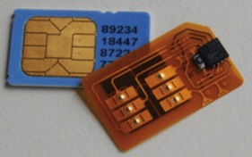
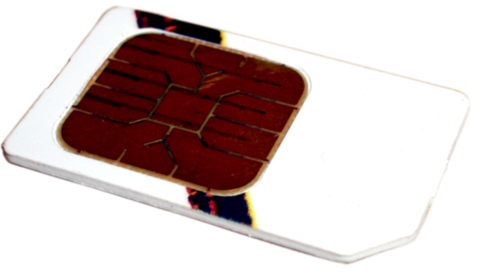
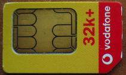
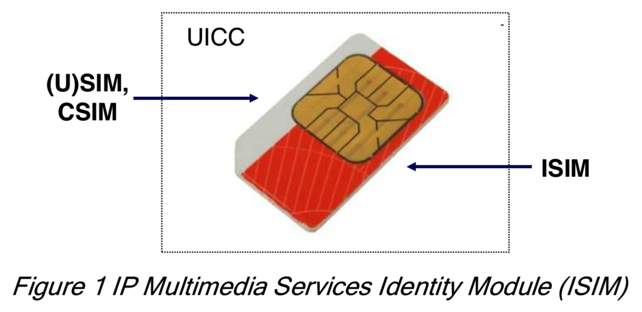

# SIM卡

* SIM
  * 相关名词
    * `UICC`=`Universal integrated circuit card`
        * 别称：`SIM卡`
      * 含义：在GSM或UTMS网络中移动终端中的智能卡=`SIM卡`
      * 图
        * 
        * 
        * 
      * 细节
        * 包含应用（程序）
          * 不同网络
            * GSM网络中，UICC中包含一个SIM应用
            * UTMS网络中，UICC中包含一个USIM应用
            *  cdmaOne/CDMA2000网络中，UICC除了包含USIM和SIM外，还包含一个CSIM应用
          * 一张卡可能包含多个程序
            * 一张卡可能同时支持GSM和UTMS
    * `ISIM` = `IMS SIM`
      * 是什么：一种应用程序application
    * UICC vs SIM vs ISIM vs USIM vs CSIM 关系
      * 
    * USIM = Universal SIM = SIM
