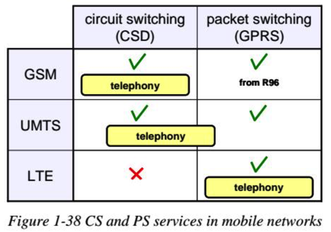

# 移动网络基础知识

* `移动网络` = `无线网络`

* 信号传输
  * 背景概述
    * 现代蜂窝网络
      * 实现LTE+IMS功能
        * 需要其他配合
          * GSM
            * 包含 GPRS/EDGE 服务
          * UMTS
            * 包含 HSDPA/HSUPA 服务
  * 结论：
    * 现在和将来很长一段时间，多种网络形式并存
      * 各种 无线接入技术=radio access technologies
        * GSM
        * UMTS
        * LTE
      * （组合）实现 各类服务
        * 传统的电话=traditional telephony
        * 数据包发送=packet transmission
          * =packet data transmission=分组数据传输
        * IMS服务=IMS service
    * 没有哪种网络比另一种好
      * 只是针对不同问题有优化，侧重点不同

* GSM vs UMTS vs LTE
  * 对比
    * 
