# 蜂窝网络 Cellular Network

* 非蜂窝网络移动系统
  * 普通
    * 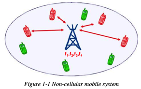
  * 容量增加
    * 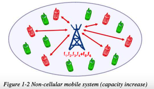
  * 覆盖面增加
    * 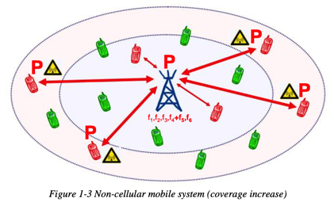
* 蜂窝网络移动系统
  * 普通
    * 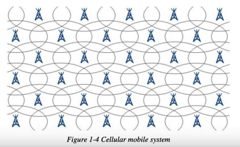
  * 频谱复用
    * 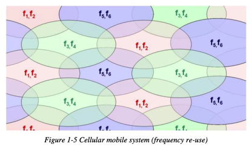
  * 容量增加
    * 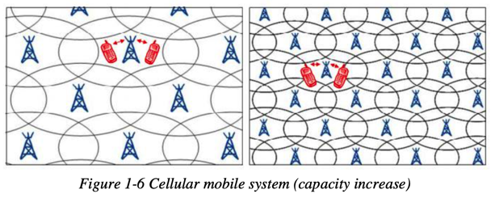
* 单元cell
  * 六角形
    * 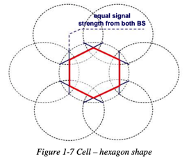
  * 六角形和实际辐射模型
    * 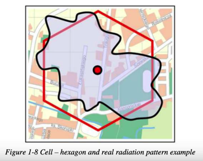
  * 天线类型
    * 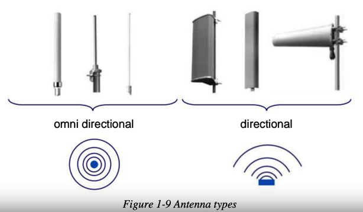
  * 单元类型
    * 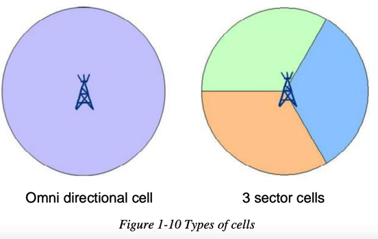
* 基站？ sector site
  * 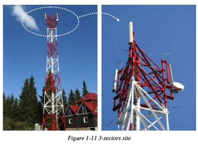
* 4/12频谱复用模型
  * 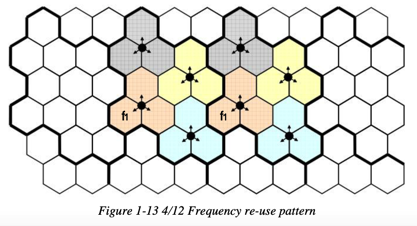
* 3/9频谱复用模型
  * 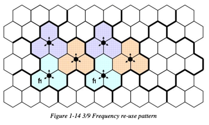
* 频谱复用模型和容量
  * 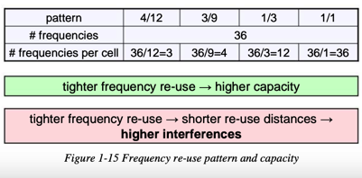
* 蜂窝系统的频谱复用模型
  * 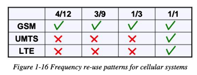
* 单元分割之前
  * 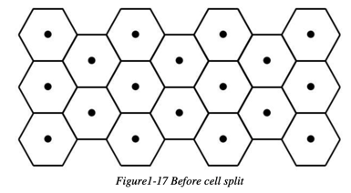
* 单元分割阶段1
  * 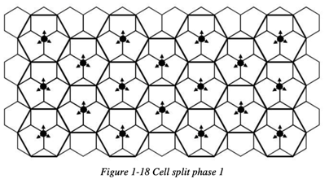
* 单元分割阶段2
  * 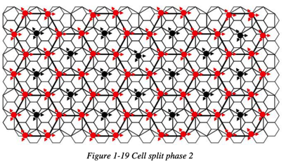
* 单元网络
  * 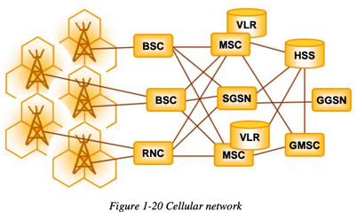

* cellular system=（移动通信领域中的）蜂窝系统
  * 旧
    * 包含
      * GSM
      * UMTS
    * 特性：
      * 基于PS的GPRS/HSPA的方案
  * 新
    * 包含
      * LTE=Long Time Evolution
      * EPS=Evolved Packet System
    * 特性
      * 对于终端用户
        * 不提供任何传统的电信服务
          * 电话telephony
          * 视频电话video-telephony
          * 短信messaging
      * 而是基于：packet bearer services数据承载业务
        * 比如
          * 发送IP数据包
            * 且保证QoS质量
      * 通过IMS提供服务
        * 底层通过
          * LTE 访问网络 = LTE access network
