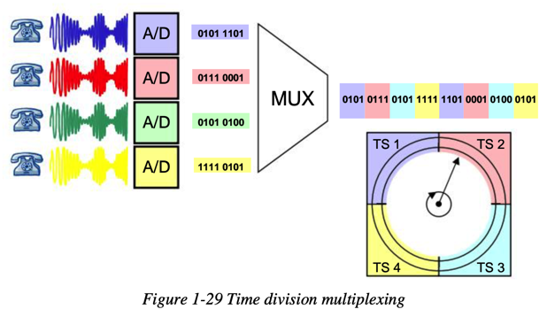
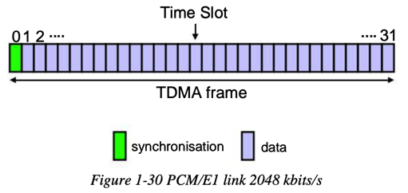
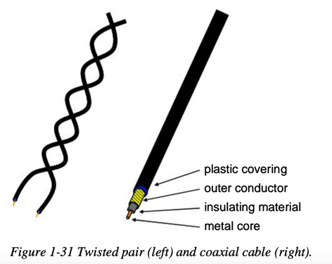
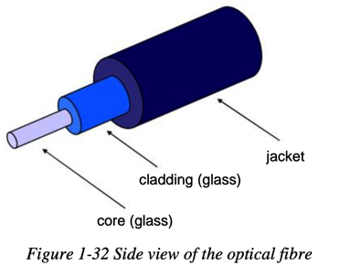
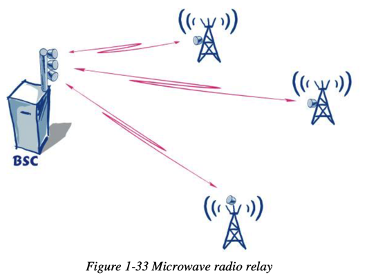
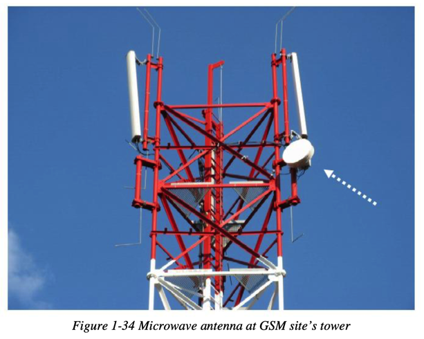

# 信号传输

* 复用
  * 时分复用
    * 
  * PCME/E1 link 2048kbit/s
    * 
* 传输材质
  * 双绞线（左）和同轴电缆（右）=Twisted pair(left) and coaxial cable(right)
    * 
  * 光纤
    * 
  * 微波（无线电）中继
    * 
    * 举例
      * GSM信号塔上的微波天线
        * 
