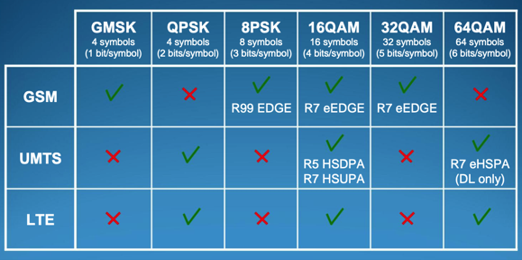
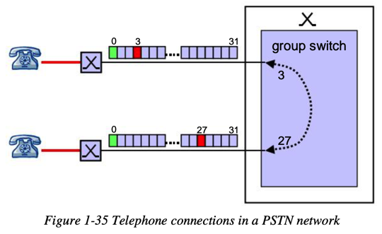
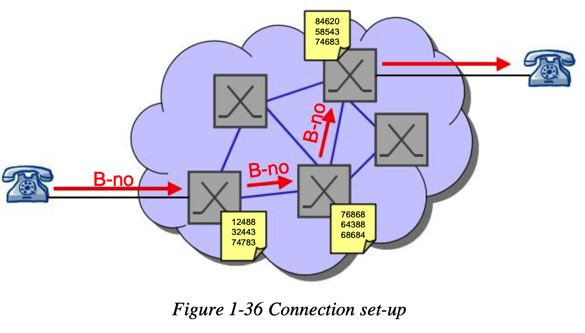
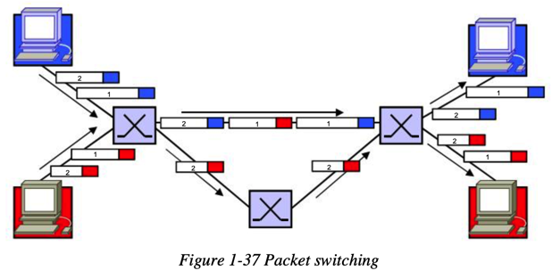

# 无线信号传输

* 信号调制对比
  * 
* 交换Switching
  * 电路交换=CS=Circuit Switching=Switching
    * 名词
      * Circuit=电路：物理上的电缆Cables
    * 含义
      * 旧
        * 在两个（订阅）用户中间，建立一条连接
          * 使得两个用户可以互相通话
      * 新=现代含义
        * 切换timeslot时间片
          * 在64kbit/s的传输通道中，通过切换时间片实现数据交换
    * PSTN网络中的电话连接
      * 
    * 建立连接
      * 
    * 典型使用场景
      * 适合：
        * 固定速度传输
          * 实时数据
            * 音频
            * 视频
      * 不适合：
        * 比如 电子邮件
          * 因为：无数据校验
            * 出错时无法检测和纠错
  * Packet Switch=包交换
    * 含义：要传输的数据，被分割成多个长度不等的数据包
      * 每个数据包都包含收件人的地址
      * 当数据包达到某网络节点时，先被保存在缓冲区中
      * 读取出目标地址
      * 根据路由表，再转发到下一个节点
        * 注：每个网络节点都保存了一个路由表
    * 包交换
      * 
    * 特点
      * 没有（针对每个用户的）专用通道
      * 传输带宽被多个连接所共享
        * 无预留（专用）带宽（容量）
          * 当前网络拥挤（无可用带宽），就只能等
      * （网络带宽）资源利用率较高
    * 适用于：
      * 主要用于数字网络中
    * 典型使用场景
      * 适合：无需固定速率的
        * 电子邮件、文件
          * （可能）支持 错误检测和校验
            * 检测发现出错，返回异常，要求重传
      * 不适合：需要固定速度的
        * 音频、视频
  * GPRS
    * 背景
      * 传统GSM网络的底层数据承载方式是CS
      * 但是多数（订阅）用户却将其用于PS网络的接入，比如Internet因特网和其他IP网络
      * 在如邮件、上网（浏览网页）等典型应用中
        * 举例
          * 浏览网页
            * 下载内容
            * 阅读
            * 下载下一个内容
      * 特点
        * 数据传输不是连续的
          * 是断断续续的
        * 传输数据量往往是：下载  远大于 上传
      * 导致
        * 带宽经常被占用
          * 但是多数时候却闲置的浪费的
        * 资源利用率很低
          * 用户和运营商都不希望这样
      * 结论
        * 出现了GPRS
          * 用于解决旧的CS数据服务的缺点
    * GPRS=General Packet Radio Service=通用分组无线业务
      * GPRS的wireless packets=无线数据包
      * 特点
        * （底层）物理链路只在需要数据传输时才被使用
        * 使用完后，立刻释放
          * 可以用于下一次传输
      * 实现
        * 多个终端（传输，用户）可以共享单条物理链路
        * 单个用户的单次传输也可以被分配（共享）使用多条物理链路
      * 结果
        * 数据传输效率更高