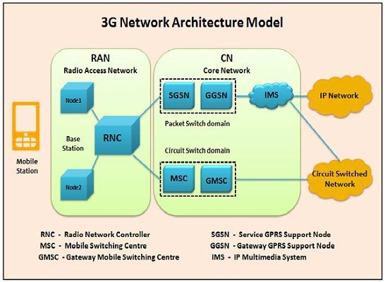
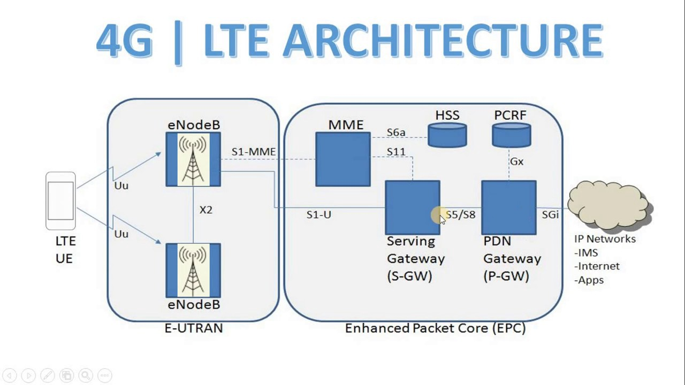
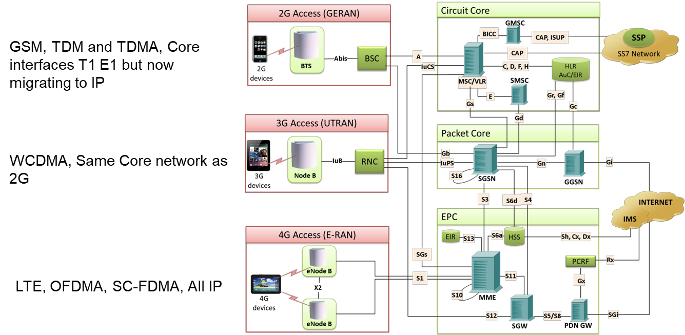
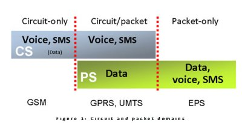

# 移动网络组成

* 移动通信网络 = `RAN` + `CN`
  * 包含
    * `RAN`=`Radio Access Network`=`无线电接入网络`
      * =`Access Network`=`接入网络`
        * `Access`=`接入`
        * `接入技术`=`无线（电）接入技术`=`radio access technology`
          * =`空口`=`air interface`
          * =`无线电接口`=`radio interface`
    * `CN`=`Core Network`=`核心网络`
  * 举例
    * 单代网络
      * `2G`
        * `GSM`= `GRAN` + `Circuit Core`
      * `2.75G`
        * `EDGE` = `GERAN` + `Circuit Core`
      * `3G`
        * `UMTS` = `UTRAN` + `Packet Core`
        * 架构图
          * 
      * `4G` = `E-UTRAN` + `EPC`
        * 架构图
          * 
      * `5G` = ? + `NGC`
    * 多代网络
      * 2G 3G 4G COMMUNICATIONS NETWORKS
        * 
  * 对比
    * Circuit and Packet Domains
      * 
  * 名词术语
    * `BBU`=`BaseBand Unit`
    * `RRH`=`Remote Radio Heads`
    * `NGC`=`Next Generation Core`=`NG Core`=`NextGen Core`
    * 
