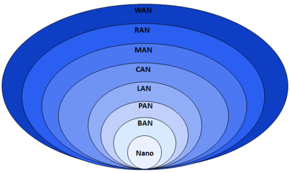

# CN

* `CN`=`Core Network`=`核心网`
  * 按照空间范围，网络可以分为
    * 图
      * 
    * 文字
      * Nanoscale
      * Near-field (NFC)
      * Body (BAN)
      * Personal (PAN)
      * Near-me (NAN)
      * Local (LAN)
        * Home (HAN)
        * Storage (SAN)
        * Wireless (WLAN)
      * Campus (CAN)
      * Backbone(=Core Network=CN)
      * Metropolitan (MAN)
      * Municipal wireless (MWN)
      * Wide (WAN)
      * Cloud (IAN)
      * Internet
      * Interplanetary Internet
