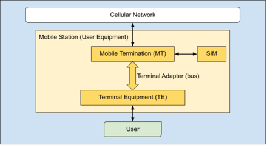
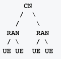

# RAN

* RAN
  * RAN=Radio Access Network
  * 是什么：移动通信系统的一部分
    * 实现了RAT
  * 具体形式
    * 一般存在于移动设备如手机中
    * 用于连接到核心网CN
  * 设备端
    * 一般被叫做
      * UE=User Equipment
      * TE=Terminal Equipment
      * MS=Mobile Station
    * 架构图
      * 
    * 举例
      * 移动手机
      * 带SIM卡的笔记本
  * 基本架构
    * 
  * 常见类型
    * `GRAN`=`GSM RAN`=`Generic RAN`=`Generic Radio Access Network`
      * 2G=GSM
    * `GERAN`=`GSM Edge RAN`=`GSM Edge Radio Access Network`
      * 和GRAN一样，额外支持EDGE
        * 支持实时的PS
      * 2.5G=EDGE
        * 引申
          * GRAN=不带EDGE的GERAN
          * ERAN=不带GSM的GERAN
    * `UTRAN`=`UMTS Terrestrial RAN`=`UMTS Terrestrial Radio Access Network`
      * 3G
      * CS和PS都支持
    * `E-UTRAN`=`Evolved Universal Terrestrial RAN`=`Evolved Universal Terrestrial Radio Access Network`
      * 4G
      * （重点在）只支持PS，优势是高速率和低延迟
      * LTE版（高速+低延迟）UTRAN
      * E-UTRAN Architecture
        * 

## 相关背景知识

### RAT

* `RAT`
  * `RAT`=`Radio Access Technology`
  * 是什么：是基于无线电（广播radio）的通信网络的底层物理连接方式
  * 常见实现方式
    * Bluetooth
    * Wi-Fi
    * GSM
    * UMTS
    * LTE
    * 5G NR
