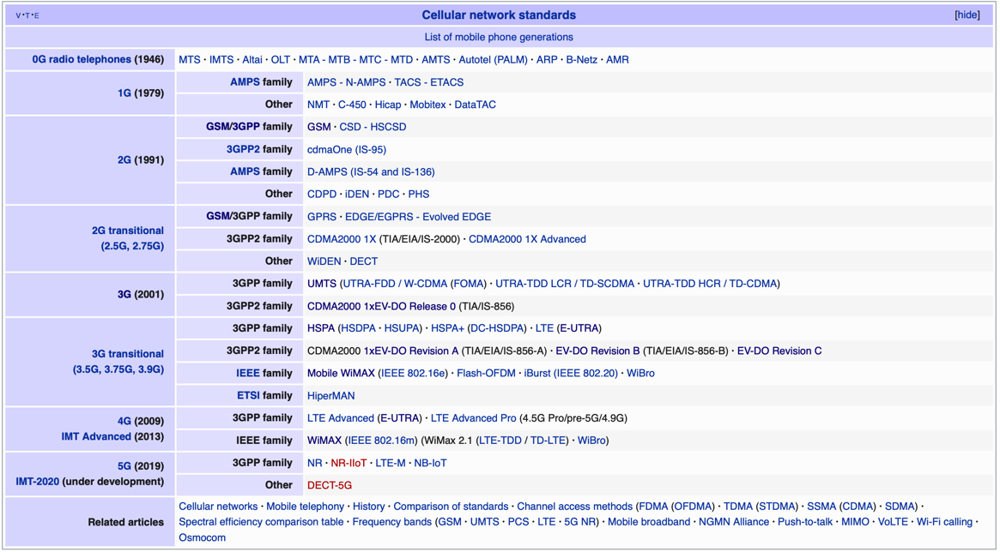
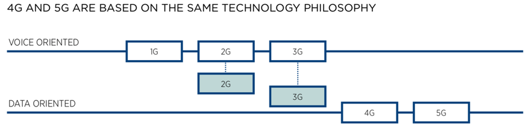
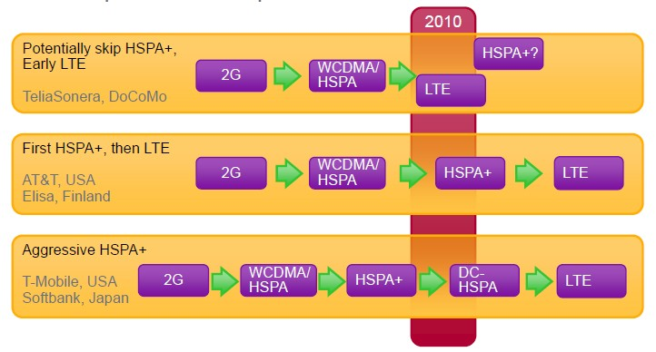
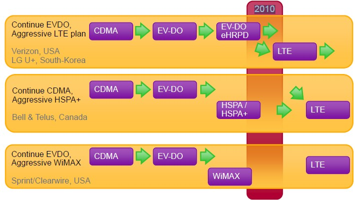
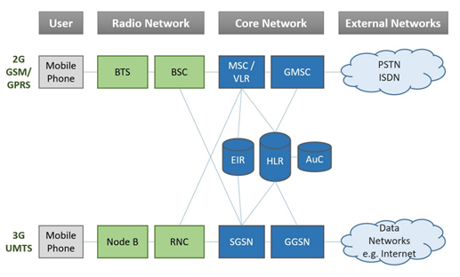
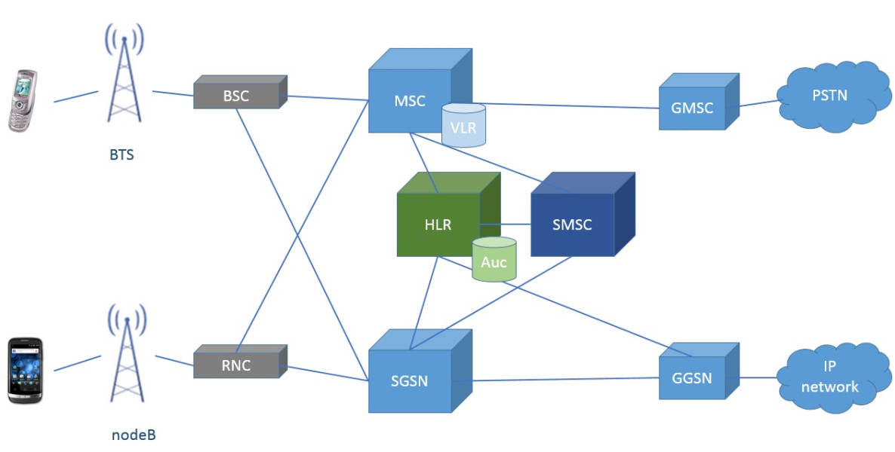
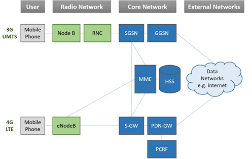
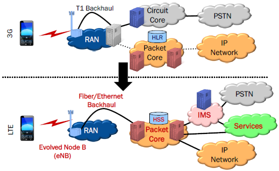
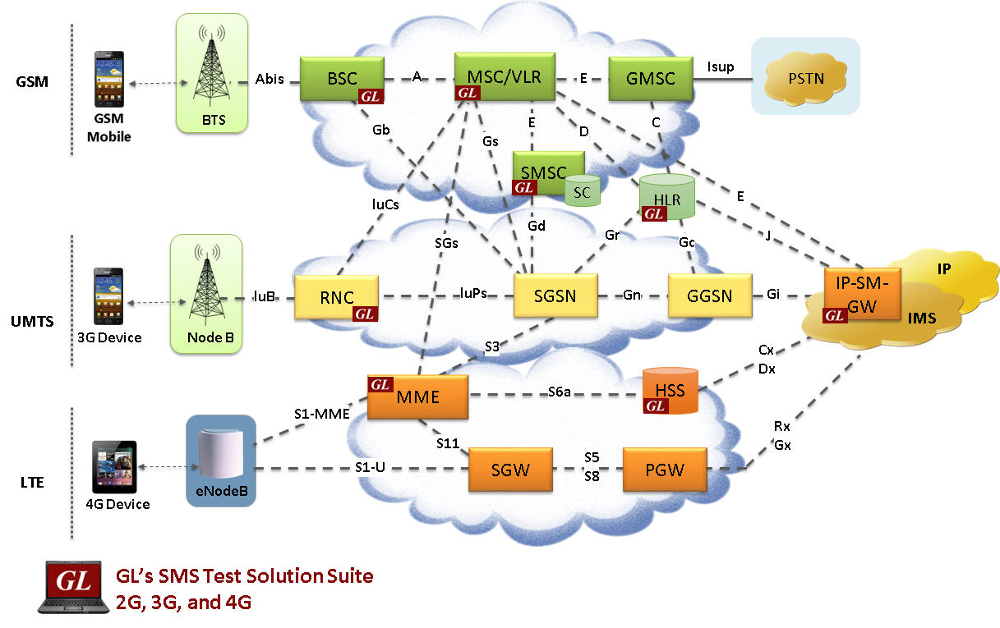
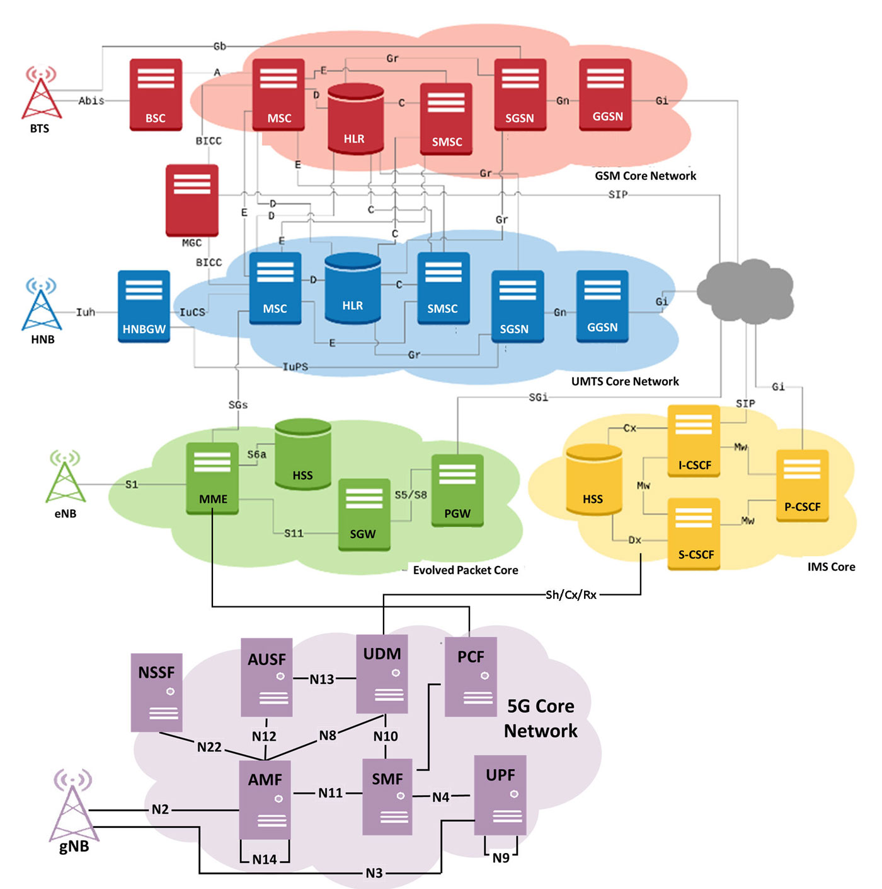

# 移动网络总结

* 概览
  * 
* 网络演化历史
  * 文字
    * 详细
      * `1G`
        * `AMPS`、`NMT`、`C-Netz`、`TACS`
          * 编码方式：`FDMA`
      * `2G`
        * `GSM`
          * 编码方式：`FDMA`和`TDMA`
          * 传输方式
            * `GPRS`
              * =`2.5G`
            * `EDGE`
              * `2.75G`
        * `D-AMPS`
        * `IS-95`=`cdmaOne`
      * `3G`
        * `UMTS`：来自`GSM`
          * `WCDMA`
          * `HSPA+`
            * `3.5G`=`HSDPA`
          * `DC-HSPA+`
        * `CDMA2000`：来自`IS-95`=`cdmaOne`
          * `EVDO`
      * `4G`
        * `LTE`
          * `TD-LTE`
          * `FDD`
      * `5G`
        * `NR`
* 不同代的网络
  * 演化图
    * 1G到5G
      * 4G和5G在语音和数据方面的发展路线
        * 
      * 相关名词和术语
        * 5GC Core
          * gNB, AMF, SMF, NSSF, UDM, AUSF, UPF
        * 4G LTE
          * eNB, MME, SGW, PGW, HSS, EIR, PCRF, OCS & OFCS
        * IMS
          * CSCFs, HSS, MGCF, MGW, AS, OCS & OFCS 
        * 3G
          * NB, HNB, HNBGW, RNC, MSC, SGSN, GGSN
        * 2G
          * BTS, BSC, MSC, HLR, EIR, VLR, SMSC, GMSC
        * TDM | PSTN
          * ISDN, ISUP, CAS
            * requires additional PSTN Network setup
        * Supports IPSec, TLS, SRTP, and MSRP
    * 2G到LTE
      * 
    * CDMA到LTE
      * 
  * 架构图
    * 2G和3G
      * High-level network diagram for GSM (2G) and UMTS (3G)
        * 
      * SMS in 2G/3G network architecture
        * 
    * 3G和4G
      * High-level network diagram for UMTS (3G) and LTE (4G)
        * 
      * Evolution of 3G Core Network to 4G Core Network
        * 
    * 2G、3G、4G
      * GL’s SMS Test Suite for LTE, UMTS, and GSM Networks
        * 
    * 2G、3G、4G、5G
      * Wireless Network Simulation (5G, 4G, 3G, 2G, IP, TDM)
        * 
