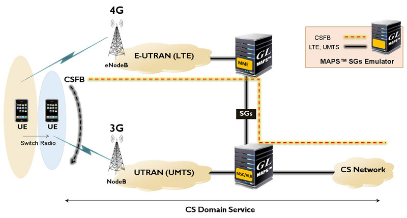
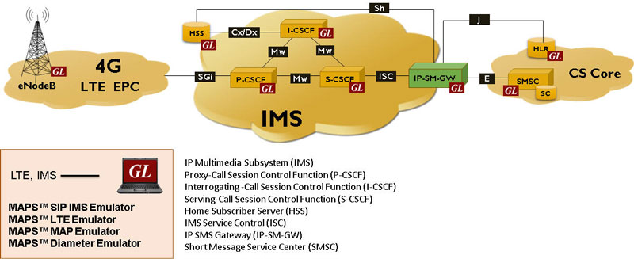
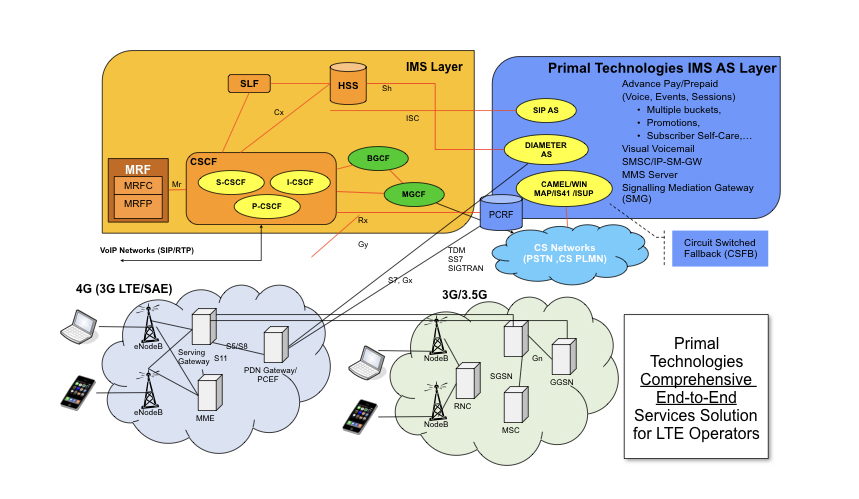

# 移动网络技术实现

## 不同实现

* GL
  * Simulation of CSFB for Voice and SMS over SGs Interface
    * 
  * Simulation of IP-SM-GW for SMS over IMS Network
    * 
* 其他
  * 

## 网络接口

* 背景
  * 不同网络，不同运营商，很复杂
  * 希望不同用户可以互相沟通
* 涉及到
  * 不同网络之间的沟通
    * `NNI`=`Network-to-Network Interface`
  * 终端网络和用户之间的沟通
    * `UNI`=`User-to-Network Interface`
