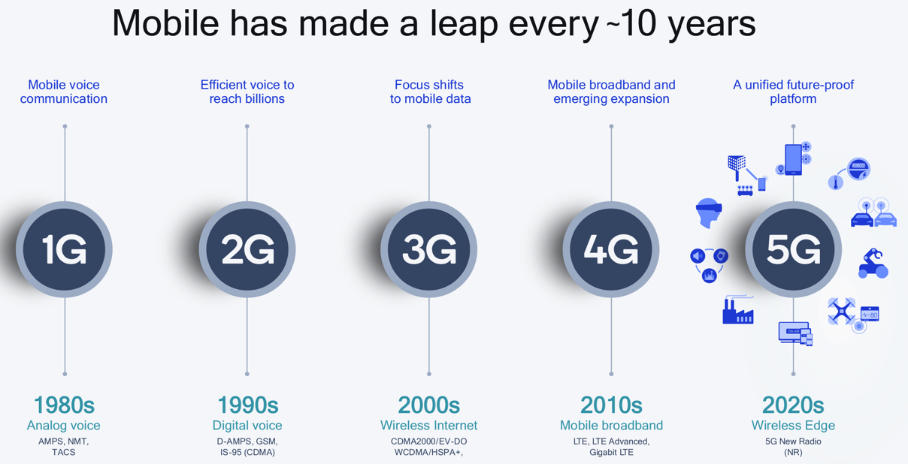

# 移动网络概述

`移动网络`=`移动通信网络` 目前经历了从第一代`1G`发展到现在最新的第五代`5G`。

精简概述：

* 图
  * 移动网络平均每10年进化一代
    * 
* 文字
  * `1G`
    * `AMPS`
  * `2G`=`GSM`
    * 编码方式：`TDMA`和`FDMA`
    * 包含
      * `2.5G`=`GPRS`
      * `2.75G`=`EDGE`
  * `3G`=`UMTS`
    * 编码方式：`WCDMA`
    * 包含
      * `3.5G`=`HSDPA`
  * `4G`=`LTE`
    * 编码方式：`OFDMA`和`SC-FDMA`
  * `5G`=`NR`
