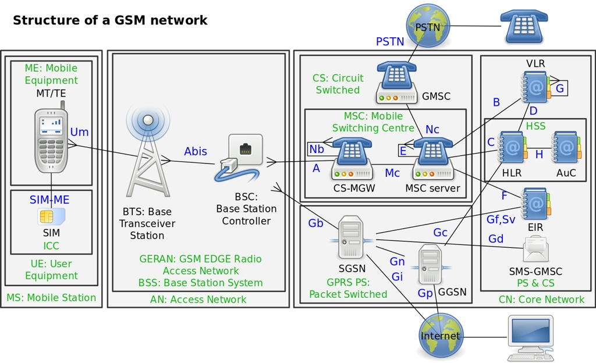
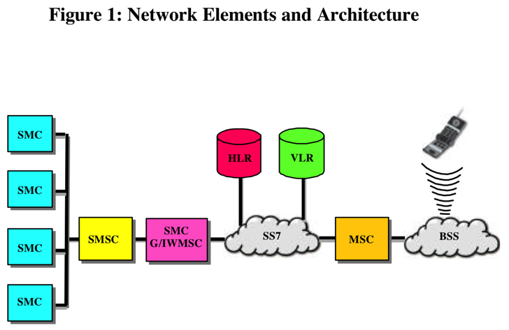
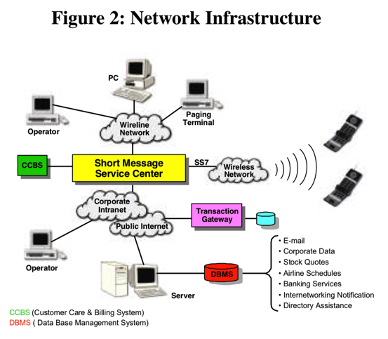
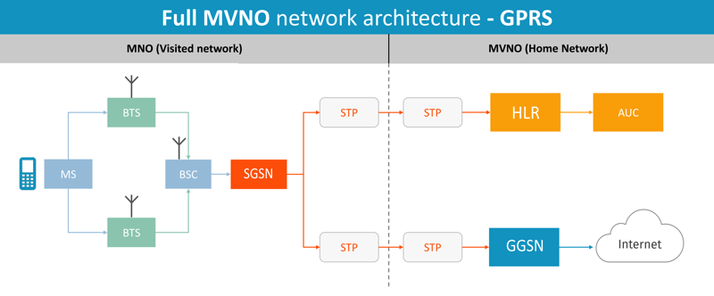
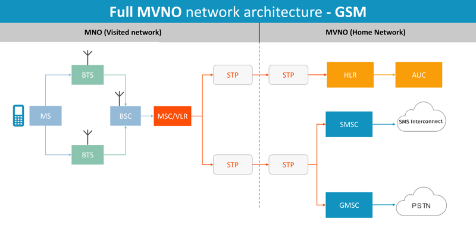
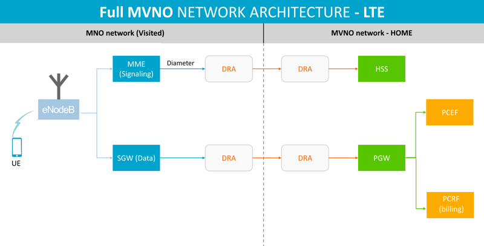

# GSM

* GSM
  * 架构
    * 
  * 包含
    * `NSS`=`Network Switching Subsystem`=`网络交换子系统`
      * 别称：`GSM核心网络`=`GSM core network`
      * 包含
        * `MSC`=`Mobile Switching Center`
          * `MSCS`=`Mobile Switching Center Server`
          * 有2种
            * `SMSC`=`Short Message Service Center`
              * 全称：`SMS-SC`=`Short Message Service - Service Center`
              * 是什么：一个网络节点
                * 移动电话网络中的一个节点
              * 作用：存储、转发、转换、传送SMS短信
              * 具体实现
                * 举例
                  * Network Elements and Architecture
                    * 
                  * Network Infrastructure
                    * 
            * `GMSC`=`Gateway Mobile Switching Center`
              * 相关架构
                * Full MVNO network architecture - GPRS
                  * 
                * Full MVNO network architecture - GSM
                  * 
                * Full MVNO network architecture - LTE
                  * 
          * 连接到`MSC`的元素
            * `HLR`=`Home Locator Register`
              * 获取SIM和MSISDN（如手机号）等数据
            * `BSS`=`Base Station Subsystems`
              * 负责2G和2.5G手机的无线电通讯
            * `UTRAN`=`UMTS Terrestrial Radio Access Network`
              * 负责3G手机的无线电通讯
            * `VLR`=`Visitor Location Register`
              * 提供用户的信息
                * 当用户不在家庭网络中
        * `HLR`=`Home Locator Register`
          * 是什么：一个数据库
            * 数据：已注册到移动核心网络的移动用户数据
              * 即所有的SIM卡信息
                * 每个SIM卡有个唯一的IMSI
                * 每个SIM卡有个MSISDN
                  * MSISDN：手机号码
        * `AuC`=`Authentication Center`
          * 是什么：是一个功能function=模块
          * 功能：认证（想要连接到GSM网络的）SIM卡
            * 比如：当手机开机（上电）后
            * 目的：确保有权限使用相关服务
