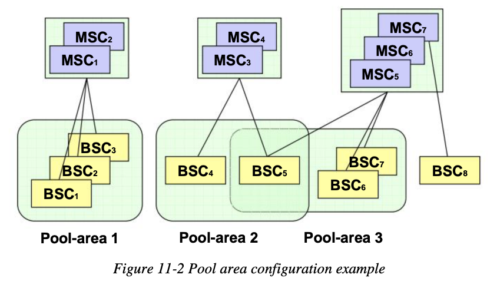
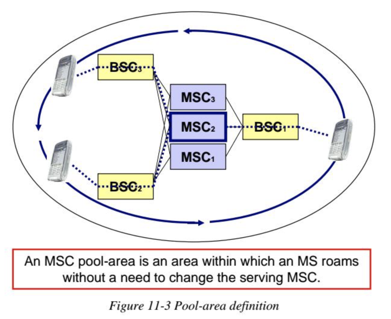
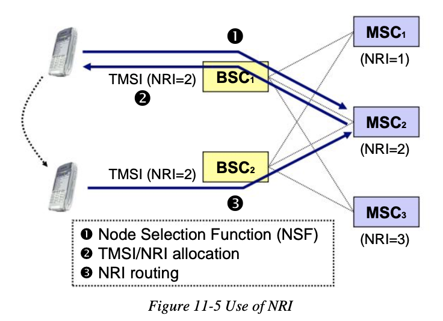
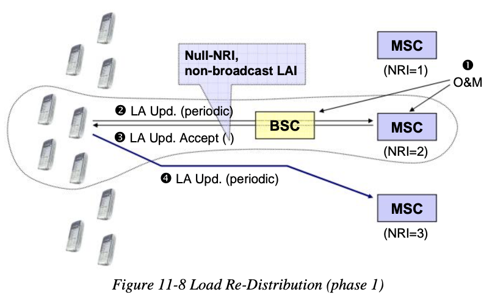

# GSM

* GSM
  * 架构
    * 
  * 包含
    * `NSS`
    * `UTRAN`
      * `RNC`
      * `RBS`
    * Operation and maintenance Support Subsystem
      * `OSS`

## NSS

* `NSS`=`Network Switching Subsystem`=`网络交换子系统`
  * 别称：`GSM核心网络`=`GSM core network`
  * 特点
    * 2G和3G网络公用(都有)
  * 包含
    * `MSC`=`Mobile Switching Center`
      * `MSCS`=`Mobile Switching Center Server`
      * 有2种
        * `SMSC`=`Short Message Service Center`
          * 全称：`SMS-SC`=`Short Message Service - Service Center`
          * 是什么：一个网络节点
            * 移动电话网络中的一个节点
          * 作用：存储、转发、转换、传送SMS短信
          * 具体实现
            * 举例
              * Network Elements and Architecture
                * 
              * Network Infrastructure
                * 
        * `GMSC`=`Gateway Mobile Switching Center`
          * 相关架构
            * Full MVNO network architecture - GPRS
              * 
            * Full MVNO network architecture - GSM
              * 
            * Full MVNO network architecture - LTE
              * 
      * 连接到`MSC`的元素
        * `HLR`=`Home Locator Register`
          * 获取SIM和MSISDN（如手机号）等数据
        * `BSS`=`Base Station Subsystems`
          * 负责2G和2.5G手机的无线电通讯
        * `UTRAN`=`UMTS Terrestrial Radio Access Network`
          * 负责3G手机的无线电通讯
        * `VLR`=`Visitor Location Register`
          * 提供用户的信息
            * 当用户不在家庭网络中
    * `VLR`=`Visitor Location Register`=`访客位置寄存器`=`漫游者位置寄存器`
    * `HLR`=`Home Locator Register`
      * 是什么：一个数据库
        * 数据：已注册到移动核心网络的移动用户数据
          * 即所有的SIM卡信息
            * 每个SIM卡有个唯一的IMSI
            * 每个SIM卡有个MSISDN
              * MSISDN：手机号码
    * `AuC`=`Authentication Center`
      * 是什么：是一个功能function=模块
      * 功能：认证（想要连接到GSM网络的）SIM卡
        * 比如：当手机开机（上电）后
        * 目的：确保有权限使用相关服务
    * `EIR`
    * `MGW`

## GSM相关架构

* GSM相关架构
  * 
  * 
  * 
  * 
  * 
  * 
  * 
  * 
  * 
  * 
  * 
