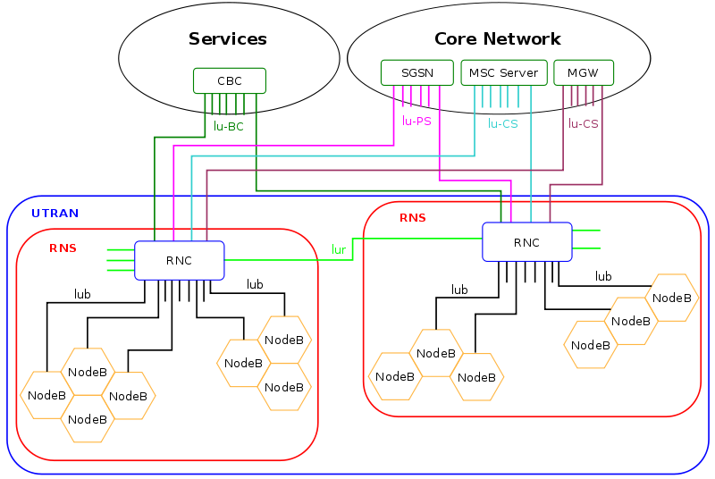

# 3G

* 3G=`UMTS`/`CDMA2000`
  * 概述
    * 3G的标准叫法：`IMT-2000`
      * `ITU`制定了`IMT-2000规范`
    * IMT-2000
      * 不同地方有具体实施标准
      * 所支持的：无线接入技术
        * `W-CDMA`
          * =`WCDMA`
        * `CDMA2000`
        * `TD-SCDMA`
        * `WiMAX`
    * 编码方式
      * 都是
        * CDMA
          * CDMA=Code Division Multiple Access
    * IMT-2000的具体实现 = （主要有）2条技术路线 track
      * 欧洲：`UMTS`
        * 演化历史
          * 从GSM发展而来
            * 别称：`3GSM`
              * 强调结合了`3G`技术而且是`GSM`标准的后续标准
        * 无线接入技术：WCDMA
          * channel：(wide) 5 MHz
          * voice codec：AMR
            * 语音质量比传统（固定电话线路）更好
          * 允许同时传输语音和数据
          * 最大速度：
            * downlink：384 kbps
            * uplink：64~384 kbps
          * UMTS 网络架构
            * 
      * 美国：`CDMA2000`
        * 演化历史
          * 从`2G`的`IS-95`（和`D-AMPS`）演化而来
            * `IS-95`
              * 别称：`cdmaOne`
        * 别称：
          * `CDMA2000 1xRTT`
          * `IS-2000`
        * CDMA2000有多种类型
          * 1xRTT
          * 1xEV-DO
          * 1xEV-DV
  * 协议标准standard
    * `UMTS`
    * `CDMA2000`
