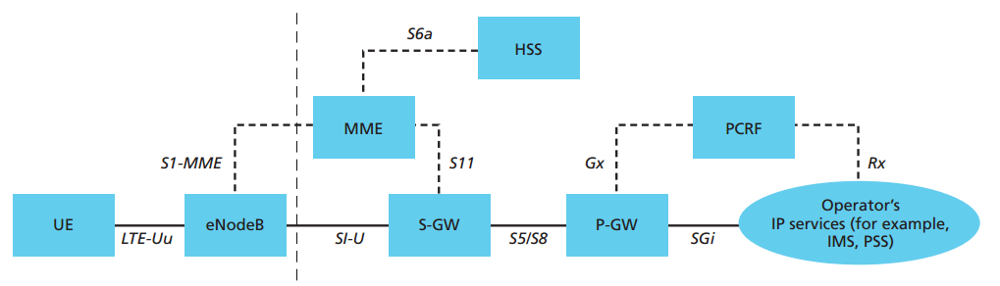
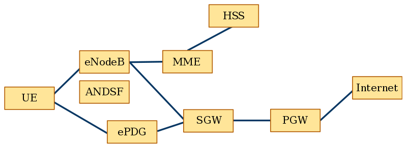
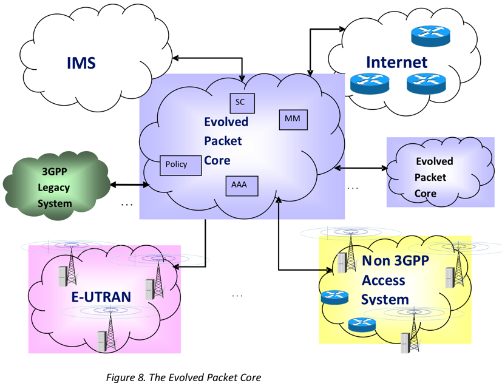

# LTE

* `LTE`背景概述
  * 之前3GPP的无线技术：有电路交换承载=CS bearer=Circuit Switched bearer
  * 而LTE：没有CS bearer
    * 没法直接支持语音传输
      * 想要：在LTE之上传输语音 = Voice over LTE = VoLTE
        * 可能的方案：VoIP=Voice over IP
          * 需要支持LTE终端的把2G或3G信号转成语音电话
            * 缺点：会降低音质，甚至导致 PS=Packed Switched 服务暂停
        * 所以：GSMA推出了：VoLTE=Voice over LTE
          * = IP Multimedia Subsystem (IMS) Profile for Voice and SMS document
        * VoLTE出现之前的临时的方案
          * 包括
            * CSFB=Circuit Switched FallBack
            * SMSoSGs
              * 作用：从LTE转到CS GSM/UMTS时建立连接
              * 目的：当网络中IMS不可用时，通过LTE实现CS call或发送传统SMS短信
          * 作用
            * 背景：当运营商还没完全支持VoLTE时
            * 可以和VoLTE配合工作以支持
              * 网络漫游
              * 紧急电话
* `LTE`技术细节
  * 编码方式：
    * downlink下行：OFDMA
      * OFDMA=Orthogonal FDMA
        * 适合多用户
    * uplink上行：SC-FDMA
      * SC-FDMA=Single-Carrier FDMA
        * 能效比高，适合用电池的移动手机
  * 最大传输速度
    * `LTE`
      * 下行：300 Mb/s
      * 上行：75 Mb/s
    * `LTE-A`=`LTE Advanced`
      * 下行：1Gb/s
    * `LTE Advanced Pro`
      * 下行：3Gb/s
  * `LTE Advanced Pro`
    * 支持
      * `MIMO`=`Multiple-Input Multiple-Output`
      * `CA`=`Carrier Aggregation`
  * 架构
    * 总体架构
      * 
    * EPC架构
      * 
      * 
  * 核心元素
    * `MME`=`Mobility Management Entity`
    * `SGW`=`S-GW`=`Serving Gateway`
    * `PGW`=`P-GW`=`PDN Gateway`
    * `HSS`=`Home Subscriber Server`
    * `PCRF`=`Policy and Charging Rules Functions`
    * `ANDSF`=`Access Network Discovery and Selection Function`=`接入网络发现和选择功能`
    * `ePDG`=`Evolved Packet Data Gateway`=`演进的分组数据网关`
    * 

* 相关名词
  * `TTI`=`Transmission Time Interval`
  * `HARQ`=`Hybrid Automatic Repeat Request`
