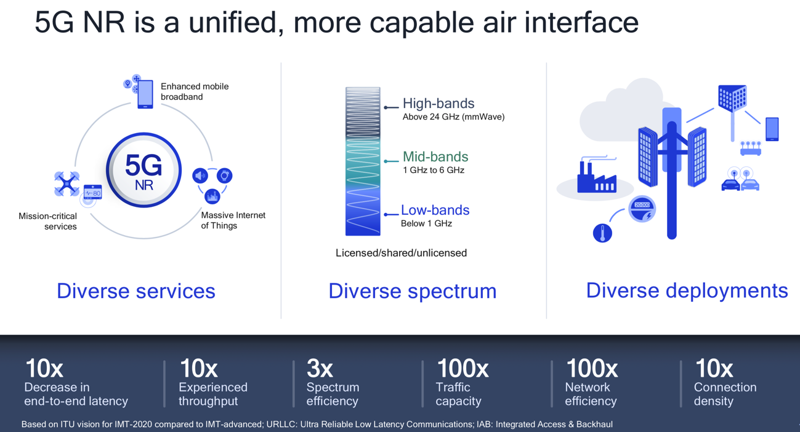
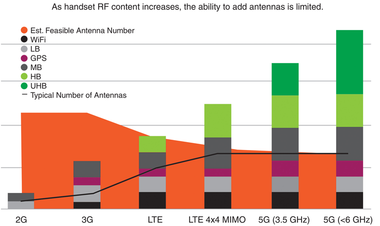
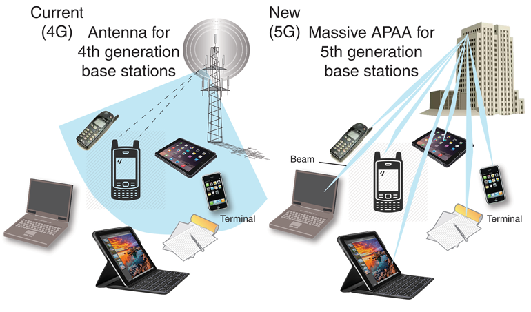
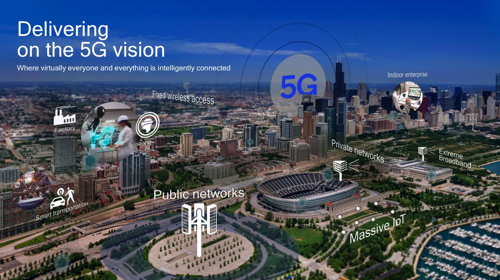
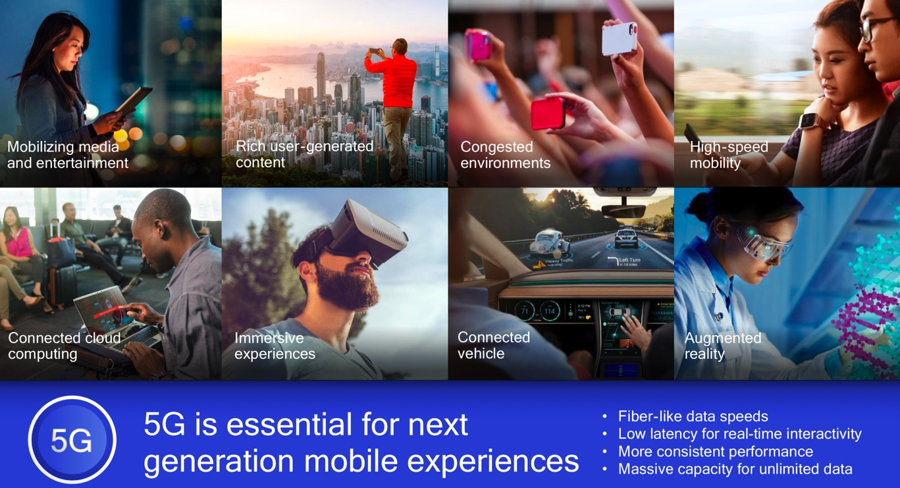
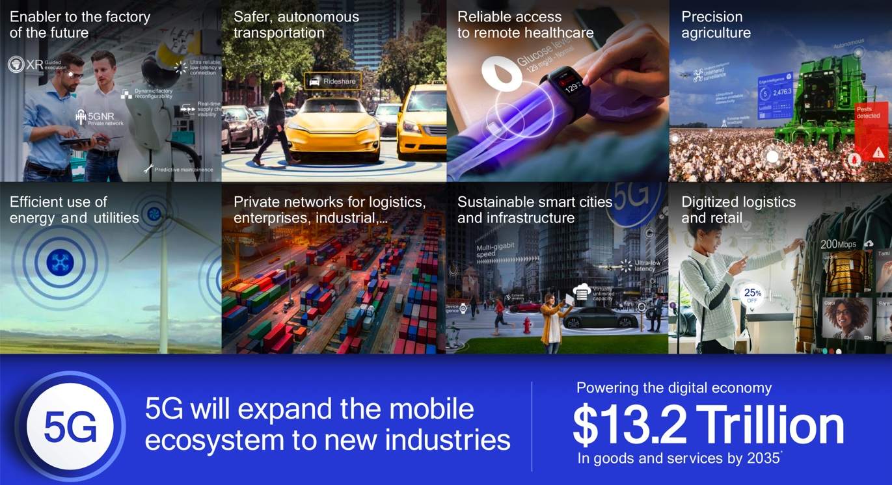
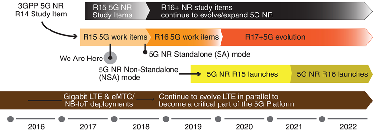
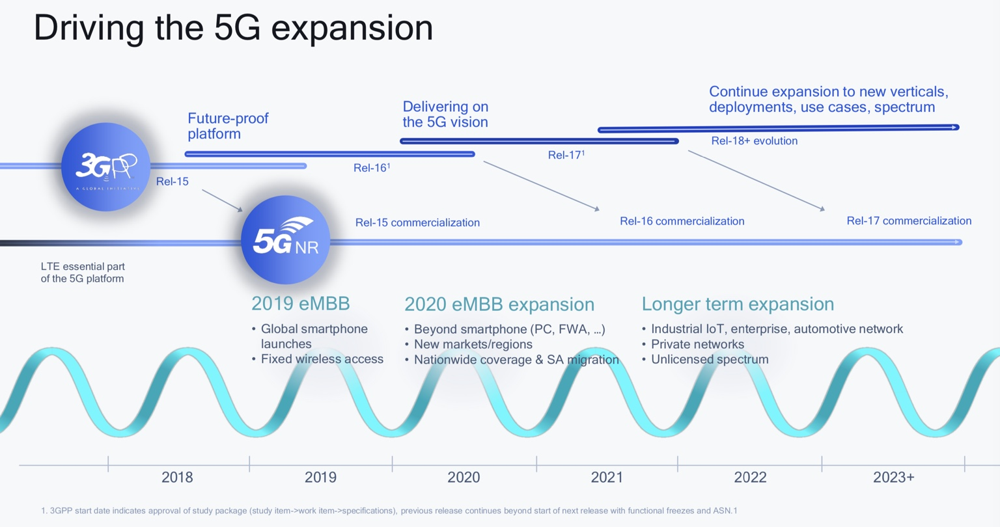
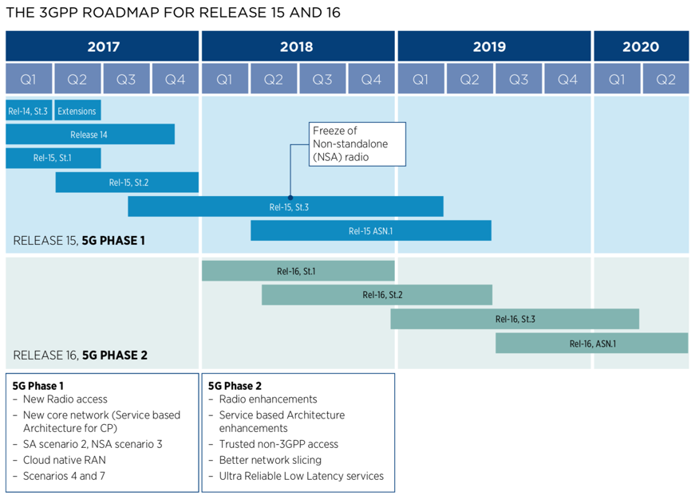
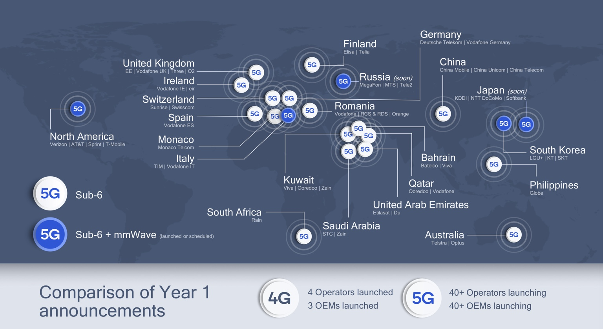

# 5G

TODO:

把

* [Qualcomm Future of 5G Building a unified, more capable 5G air interface for the next decade and beyond](https://www.qualcomm.com/media/documents/files/making-5g-nr-a-commercial-reality.pdf)
* [The-5G-Guide_GSMA_2019_04_29_compressed.pdf](https://www.gsma.com/wp-content/uploads/2019/04/The-5G-Guide_GSMA_2019_04_29_compressed.pdf)

中关于5G技术内容整理过来

---

> 关于5G更多细节，详见：[5G技术概述](https://book.crifan.com/books/5g_tech_summary/website/)

* 5G
  * =`fifth generation`
  * `3GPP`组织制定的标准
  * 概述
    * 
  * 频段范围
    * `FR1`=`Frequency Range 1`
      * 包括 sub-6 GHz
    * `FR2`=`Frequency Range 2`
      * 包括了`mmWave`=`mm-wave`的24–100GHz
  * 2G到5G频谱对比
    * 
  * 相关技术
    * Massive MIMO
      * 
  * 应用
    * 概览
      * 
      * 
      * 

## 5G标准版本历史

* 5G标准版本历史
  * 图
    * 
    * 
    * THE 3GPP ROADMAP FOR RELEASE 15 AND 16
      * 
  * 文字
    * 2015年：开始研究
    * 2017年：第一次发布 5G NSA
    * 2018年：3GPP `Release 15`=5G `phase 1`
      * `eMBB`=`Enhanced Mobile Broadband`
      * `URLLC`=`Ultra-Reliable and Low Latency Communication`
    * 2020年6月：3GPP `Release 16`=5G `phase 2`
      * `mMTC`=`massive Machine Type Communication`
      * `V2V`=`Vehicle to Vehicle`
    * 预计2021年：`Release 17`

## 4G vs 5G

| Technology | Data Rates | Latency | Mobility Support | Spectrum Efficiency | Users Density |Energy Efficiency |
| ---------- | ---------- | ------------------------ | ------------------- | ------------- | ---------- |
| 5G (NR) | Avg 100 Mb/s Peak 20 Gb/s |  ~ 1 ms | >500 Km/h | x3 Better DL- 30 bits/Hz UL- 15bits/Hz |  1000K/Km2 | x100 Better |
| 4G (LTE) | Avg 25 Mb/s Peak 300 Mb/s |  ~10- 50 ms | <=350 Km/h | DL – 6 bits/Hz UL- 4 Bits/Hz | ~ 2K/Km2 | Moderate |

## 运营商支持5G情况

