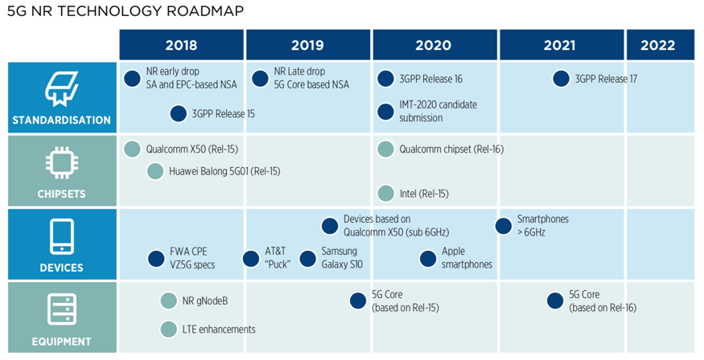
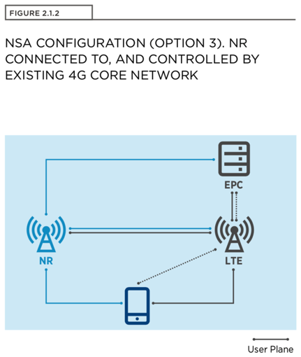
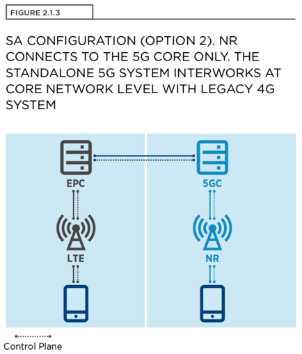
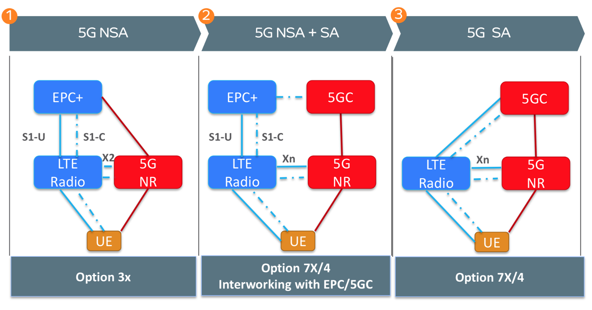
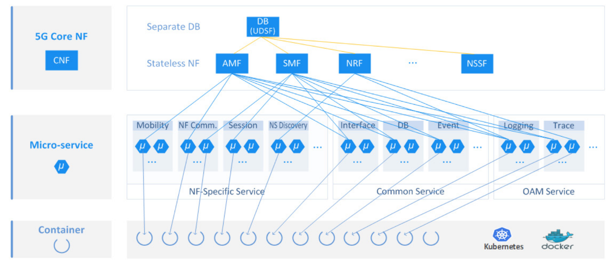
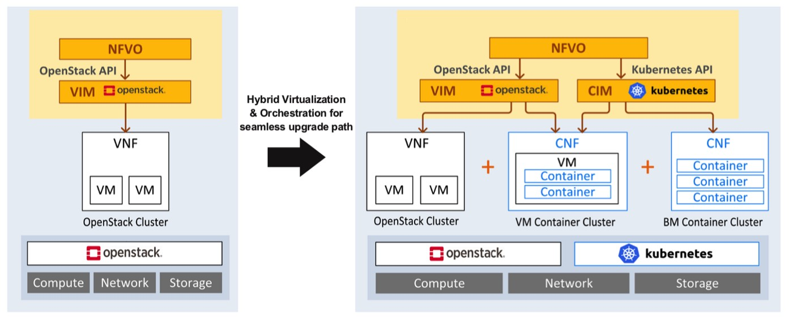

# NR

* `NR`
  * =`New Radio`
  * 编码方式：`OFDM`
  * 路线图
    * 5G NR TECHNOLOGY ROADMAP
      * 
  * 部署
    * 2种模式：`NSA`和`SA`
      * 包含
        * 基于已有4G LTE的：`NSA`=`Non-StandAlone`
          * 
        * 纯5G的：`SA`=`StandAlone`
          * 
      * 对比
        * Core Network SA and NSA Modes
          * 
    * 云模式
      * Container Based Cloud Native 5G Core
        * 
      * Hybrid Cloud Native 5G Core Architecture
        * 
